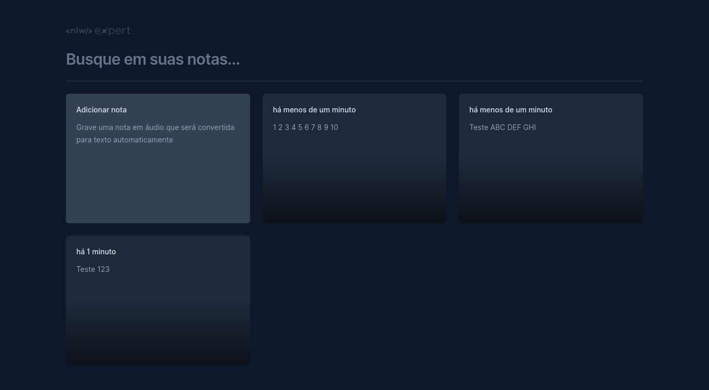

# NLW Expert Notes

Projeto desenvolvido com ReactJS, durante a NLW Expert da Rocketseat

## Tecnologias usadas

- ReactJS
- [ViteJS](https://vitejs.dev/)
- [TailwindCSS](https://tailwindcss.com/)
- [Radix ui](https://www.radix-ui.com/)
- [date-fns](https://date-fns.org/)
- [lucide-react](https://lucide.dev/)
- [Sonner](https://sonner.emilkowal.ski/)